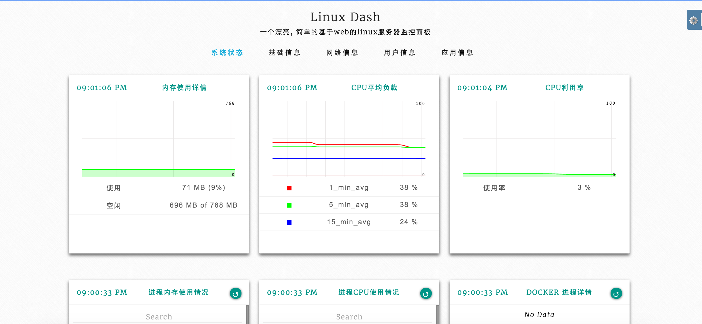

# linux-dash 的汉化版
#### 原地址: https://github.com/afaqurk/linux-dash
---
<p align="center">
  <sub>v2.0</sub><br/>
  <small>适用于linux系统的简单且开销较低的Web仪表板</small>
</p>

<p align="center">
  <small>
    演示 &nbsp;|&nbsp;
    <a href="https://github.com/afaqurk/linux-dash/wiki">
      文档
    </a>
  </small>
</p>

<p align="center">
  <a href="https://github.com/NoBey/linux-dash-zh">
    
  </a>
</p>

<br/>

<p align="center">
  <a href="https://github.com/NoBey/linux-dash-zh">
    
  </a>
</p>

<br/>

## 特色
* **小巧** ----- 仅占用硬盘400KB _（不计.git）！_
* **纯朴** ----- 简约、美观的仪表板
* **简易** ----- 嵌入式安装
* **多元** ----- 从Node.js、Go、Python、PHP中选择堆栈

## 安装

### 第1步
```sh
## 1. 克隆仓库
git clone --depth 1 https://github.com/NoBey/linux-dash-zh.git

## 2. 转到克隆的目录
cd linux-dash-zh/server

```
或者，如果您希望手动下载：

```sh
## 1. 下载.zip
curl -LOk https://github.com/NoBey/linux-dash-zh/archive/master.zip && unzip master.zip

## 2. 转到下载并解压缩的目录
cd linux-dash-master/app/server

```

### 第2步

请参阅有关首选服务器linux-dash服务器的说明 _（全部纳入）_：

* [Node.js](#if-using-nodejs) _（推荐）_
* [Go](#if-using-go)
* [Python](#if-using-python)
* [PHP](#if-using-php)

#### 如果使用Node.js
```sh
## 安装依赖
npm install --production

## 启动linux-dash（默认情况下在80端口上；可能需要sudo）
## 您可以使用环境变量`LINUX_DASH_SERVER_PORT`来更改它（例如`LINUX_DASH_SERVER_PORT=8080 node server`）。
## 或在下面的命令中提供--port标志
node index.js

```

#### 如果使用Go
```sh
## 启动服务器（默认情况下在80端口上；可能需要sudo）
go run index.go
```

要构建二进制文件，请运行`go build && ./server -h`。有关二进制用法选项，请参见[此处](https://github.com/afaqurk/linux-dash/pull/281)[@tehbilly](https://github.com/sergeifilippov)的注释

#### 如果使用Python
```sh
# 启动服务器（默认情况下在80端口上；可能需要sudo）。
python index.py
```

#### 如果使用PHP

1. 确保已启用`exec`、`shell_exec`和`escapeshellarg`函数
2. 将您的Web服务器指向`linux-dash`下的`app/`目录
2. 重新启动您的Web服务器（Apache、nginx等）
  - 对于设置PHP+Apache，请遵循[Digital Ocean tutorial](https://www.digitalocean.com/community/tutorials/how-to-install-linux-dash-on-ubuntu-14-04)。
  - 有关设置nginx的帮助，请参阅[@sergeifilippov](https://github.com/sergeifilippov)的[这个gist](https://gist.github.com/sergeifilippov/8909839)。

## 支持

`issues`

## 安全

**强烈建议**通过您选择的安全措施来保护所有linux-dash的安装。

Linux Dash没有任何安全性并不提供身份验证功能。
